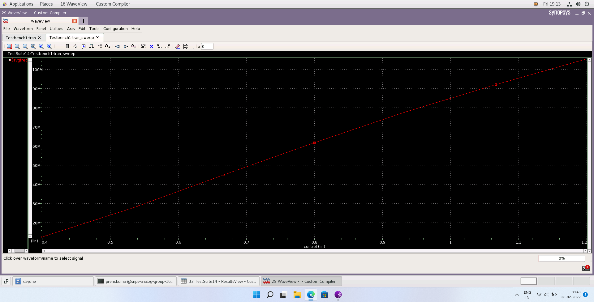
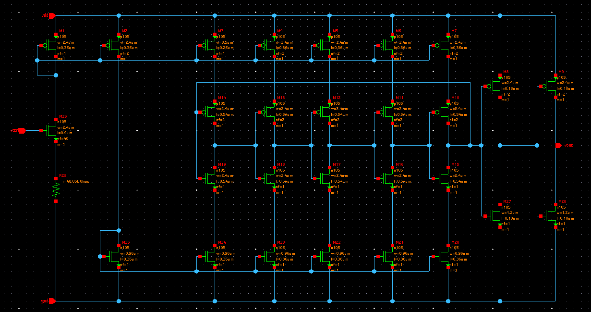
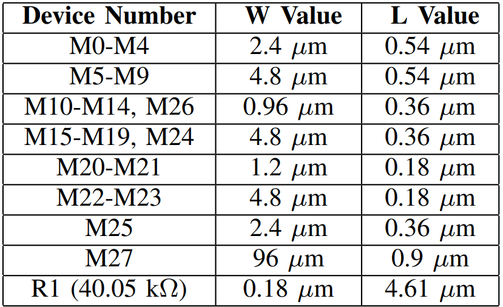
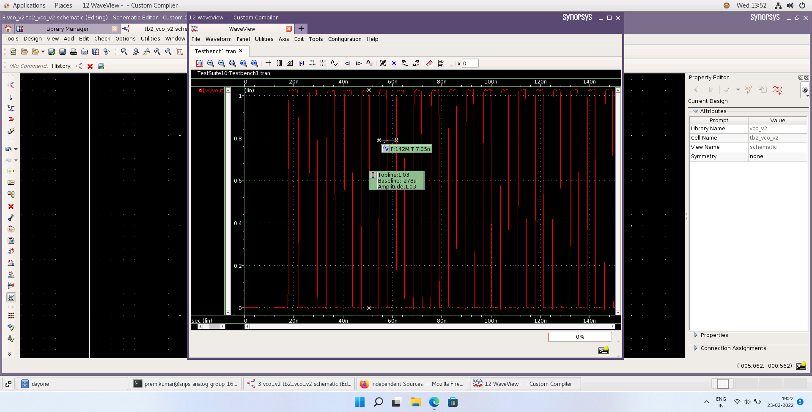

# 5 stage 2.92 GHz CMOS Voltage Controlled Oscillator
Documenting the design process of a VCO on the SYNOPSYS Custom Compiler - 28nm PDK.

### About
Following the [4:16 bottom up decoder](https://github.com/virginrobotics/bottomupdecoder_esim_ngspice), I got the oppurtunity compete in another hackathon - the Analog IC Design Hackathon SYNOPSYS IITH (VSD organized) , and the logical step was to design an analog circuit , hence the VCO. 
Voltage Controlled Oscillators , as the name suggests allow you to linearly tune the output frequency of an oscillator through a control voltage over a frequency range. VCOs are an integral component of PLL(Phase Locked Loop) systems. Most design challanges come in the form of choosing right w/l ratios, biasing, lowering Vdd/Vctrl and power. The VCO designed here was referenced from this [paper](https://www.researchgate.net/publication/333347988_Design_and_Analysis_of_Current_Starved_VCO_Targeting_SCL_180_nm_CMOS_Process), a few tweaks allowed a max output of 2.92 GHz.    

<h2> Navigation: </h2>

1. [How does a VCO work ?](https://github.com/virginrobotics/bottomupdecoder_esim_ngspice#-a-416-decoder-)
2. [Initial design](https://github.com/virginrobotics/bottomupdecoder_esim_ngspice#not-gate-submodule)
3. [Tools ](https://github.com/virginrobotics/bottomupdecoder_esim_ngspice#and-gate-submodule)
4. [Fingering](https://github.com/virginrobotics/bottomupdecoder_esim_ngspice#24-decoder-submodule)
5. [Reference VCO Perfomance](https://github.com/virginrobotics/bottomupdecoder_esim_ngspice#realizing-the-416-decoder-using-24-submodules)
6. [Tweaks](https://github.com/virginrobotics/bottomupdecoder_esim_ngspice#important-mistakes)
7. [Parametric Sweep](https://github.com/virginrobotics/bottomupdecoder_esim_ngspice#recreate-simulation-output)
8. [Final Results](https://github.com/virginrobotics/bottomupdecoder_esim_ngspice#eda-tools-used)
9. [Improvements](https://github.com/virginrobotics/bottomupdecoder_esim_ngspice#things-to-improve)
10. [Thanks to](https://github.com/virginrobotics/bottomupdecoder_esim_ngspice#thanks-to)
11. [References](https://github.com/virginrobotics/bottomupdecoder_esim_ngspice/blob/main/README.md#references)

<h3> How does a VCO work ? </h3>

The VCO is made up of a 5 stage ring oscillator where the output of the final inverter stage is fed back to the input of the first inverter stage where the frequency of oscillation is given by the equation. 

<h3> Initial Design </h3>

The reference VCO uses a current starving technique to allow use a seperate control voltage instead of just the vdd, acting as the control and source. This lets the output waveform maintain amplitude at or near vdd across the tunable range.

PMOS M3-M7 and NMOS M20-M24 are the current sources that limit the current to inverter stages - controlling delay. The W and L values were taken straight from the referenced paper , as shown below. 

The W/L ratios are governed by the following equation which relates to the total capacitance in equation 1.

)

The schematic was converted to a symbol in the Custom Compiler for use in a test bench where a DC source was connected to Vdd and an exponential source to Vctrl. 

Why an exponential source and not a DC source? I had the same question , answered by a fellow contestant in the hackathon forum 

>Schematic doesn't have noise of any kind to begin with , but when we do theoretical calculations for an oscillator we assume that noise/any small perturbation is amplified through +ve feedback so much that sustainable oscillations are met at output. So when you give a ramp/exponential supply you are providing that noise/disturbance deliberately

Hence , a rise time of 5 or 10 nanoseconds was enough to kick the VCO into sustained oscillations. 

Here's the output for control voltage @ 1.8V and Vdd @ 1.8V. Osciallations ~ 140MHz.

A Vin vs Freq curve for a sweep from 0.4V to 1.8V. The measured VCO gain is ~ 125.27Mhz/V

<h3> Fingering </h3>

The Synopsys Custom Compiler didn't allow mosfet node lengths to exceed 3.5um but the design required lengths of 4.8um , 96um etc.

The solution is to realize the required lengths through multiple fingers , example - to realize a 96um pmos, you create 40 fingers with 2.4um per finger to achieve desired size. 
However, there are penalties in the form of gate resistance , which can be reduced by employing parallel fingers but perimeter source/drain capacitance increases with more fingers. A common convention is to choose a finger width whose resistance is less than the inverse transconductance (gm) associated with the finger. 

Page - 737, Design of Analog CMOS Integrated Circuits - Behzad Razavi

